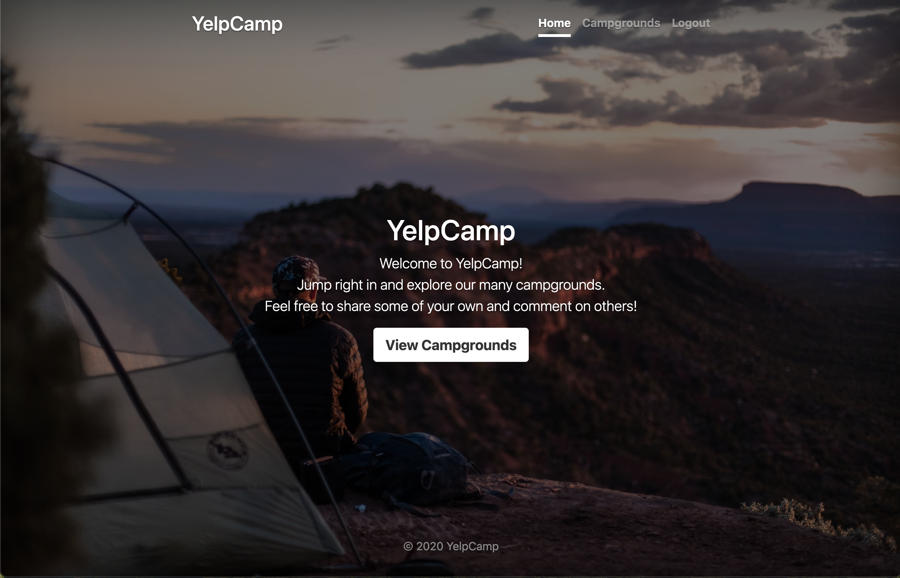
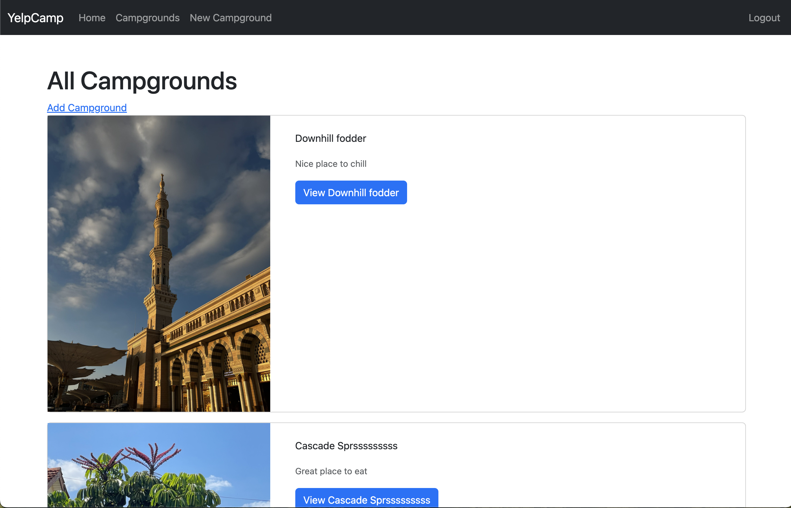
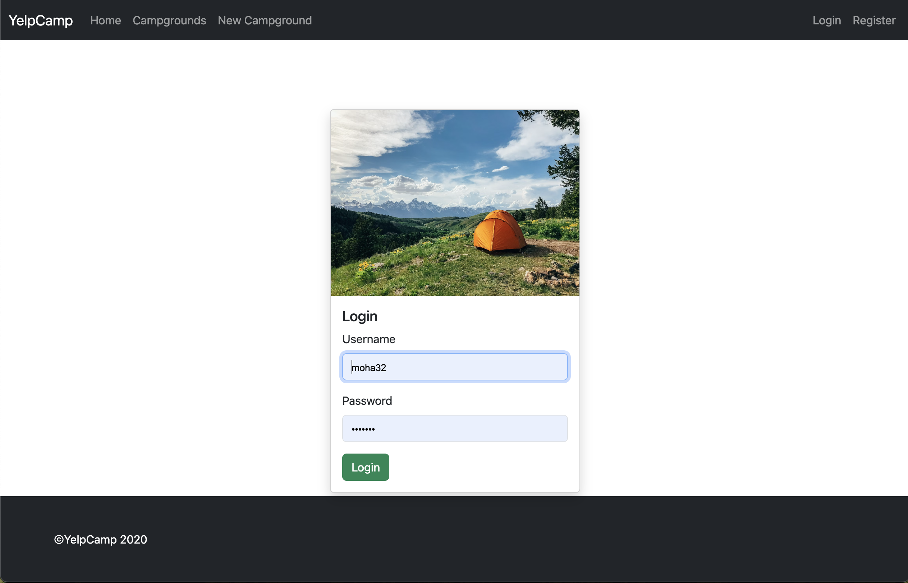
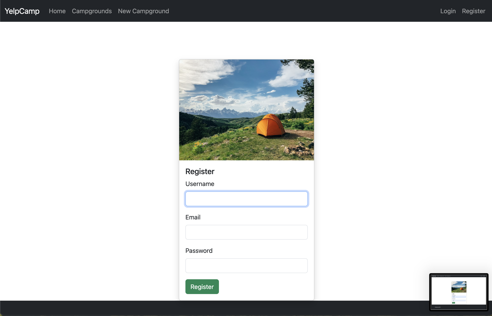

# YelpCamp

YelpCamp is a web application for sharing and discovering campgrounds. Users can register, log in, add new campgrounds, view existing ones, and leave reviews.

## Features

- **User Authentication:**
  - Users can register and log in securely.

- **Campground Management:**
  - Users can add new campgrounds.
  - Users can view existing campgrounds.

- **Review System:**
  - Users can leave reviews for campgrounds.

## Security Features

YelpCamp integrates various security features to ensure a safe user experience:

- **Password Hashing:**
  - User passwords are securely hashed.

- **HTML Sanitization:**
  - HTML content is sanitized to prevent cross-site scripting (XSS) attacks.

- **Joi Schema Validation:**
  - Joi is used for schema validation, ensuring data integrity.

- **Mongo Protection:**
  - Protection measures are implemented to secure interactions with MongoDB.

- **Helmet Middleware:**
  - Helmet is used to enhance the security of the app by setting various HTTP headers.

- **Content Security Policy (CSP):**
  - CSP is implemented to prevent various types of code injection attacks.

## Tech Stack

- **Frontend:**
  - JavaScript
  - Bootstrap

- **Backend:**
  - Node.js
  - Express

- **Database:**
  - MongoDB with Mongoose

